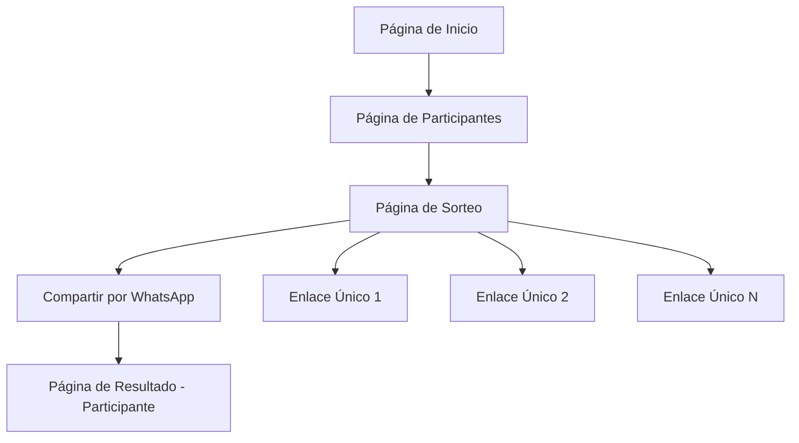

## 1. Product Overview
Aplicación web para organizar sorteos de amigos secretos (amigo invisible) de Navidad. Permite agregar participantes, realizar un sorteo aleatorio sin auto-asignaciones, y compartir el resultado mediante enlaces únicos por WhatsApp.

- Problema a resolver: Facilitar la organización de intercambios de regalos navideños entre amigos y familiares
- Usuarios: Cualquier persona que quiera organizar un amigo secreto
- Valor: Simplifica el proceso de asignación y notificación de participantes

## 2. Core Features

### 2.1 User Roles
| Role | Registration Method | Core Permissions |
|------|---------------------|------------------|
| Organizador | Acceso directo a la app | Crear sorteo, agregar participantes, compartir resultados |
| Participante | Recibe enlace de invitación | Ver su amigo asignado |

### 2.2 Feature Module
La aplicación de amigo secreto consiste en las siguientes páginas principales:
1. **Página de inicio**: introducción, botón para crear nuevo sorteo
2. **Página de participantes**: formulario para agregar nombres, lista de participantes
3. **Página de sorteo**: realizar sorteo, mostrar resultados, generar enlaces de compartición
4. **Página de resultado**: mostrar el amigo asignado al participante

### 2.3 Page Details
| Page Name | Module Name | Feature description |
|-----------|-------------|---------------------|
| Página de inicio | Hero section | Título descriptivo, imagen navideña, botón "Crear nuevo sorteo" |
| Página de inicio | Información | Breve explicación de cómo funciona el amigo secreto |
| Página de participantes | Formulario de entrada | Campo de texto para nombre, botón para agregar participante |
| Página de participantes | Lista de participantes | Mostrar nombres agregados, permitir eliminar participantes |
| Página de participantes | Acciones | Botón para realizar sorteo cuando hay mínimo 3 participantes |
| Página de sorteo | Resultado del sorteo | Mostrar lista de asignaciones de forma privada |
| Página de sorteo | Generar enlaces | Crear enlace único para cada participante con su asignación |
| Página de sorteo | Compartir por WhatsApp | Botón para compartir enlace directamente por WhatsApp |
| Página de resultado | Información del amigo | Mostrar nombre de la persona asignada al participante |
| Página de resultado | Mensaje navideño | Incluir mensaje festivo sobre el intercambio de regalos |

## 3. Core Process
**Flujo del Organizador:**
1. Accede a la aplicación desde la página principal
2. Crea un nuevo sorteo haciendo clic en el botón principal
3. Agrega los nombres de todos los participantes
4. Revisa la lista de participantes agregados
5. Realiza el sorteo cuando todos los participantes estén agregados
6. Visualiza las asignaciones de forma privada
7. Genera enlaces únicos para cada participante
8. Comparte los enlaces por WhatsApp a cada participante

**Flujo del Participante:**
1. Recibe el enlace por WhatsApp
2. Abre el enlace en su navegador
3. Ve el nombre de su amigo secreto asignado
4. Guarda la información para comprar el regalo

## 4. User Interface Design

### 4.1 Design Style
- **Colores primarios**: Rojo navideño (#DC143C), Verde navideño (#228B22)
- **Colores secundarios**: Dorado (#FFD700), Blanco nieve (#FFFAFA)
- **Estilo de botones**: Redondeados con bordes suaves, efecto hover sutil
- **Tipografía**: Fuente legible y amigable (ej. Nunito, Poppins)
- **Tamaños de fuente**: Títulos 2rem, subtítulos 1.5rem, texto normal 1rem
- **Estilo de layout**: Basado en tarjetas con sombras suaves
- **Iconos**: Estilo emoji navideño (🎄🎅🎁) para mantener ambiente festivo

### 4.2 Page Design Overview
| Page Name | Module Name | UI Elements |
|-----------|-------------|-------------|
| Página de inicio | Hero section | Fondo con gradiente rojo-verde, título "Amigo Secreto de Navidad" con tipografía festiva, ilustración de regalos |
| Página de inicio | Botón principal | Botón grande rojo con texto blanco "Crear Nuevo Sorteo", icono de saco de regalos |
| Página de participantes | Formulario | Campo de entrada con placeholder "Nombre del participante", botón verde "Agregar" con icono + |
| Página de participantes | Lista | Tarjetas blancas con nombre del participante, botón rojo pequeño para eliminar con icono 🗑️ |
| Página de sorteo | Resultados | Lista en tarjetas doradas mostrando asignaciones, manteniendo privacidad |
| Página de sorteo | Botones de acción | Botón verde "Generar Enlaces de WhatsApp", icono de WhatsApp, botón para copiar enlaces |
| Página de resultado | Información | Tarjeta festiva con fondo de copos de nieve, nombre del amigo en letras grandes doradas |
| Página de resultado | Mensaje | Texto informativo sobre el intercambio de regalos con iconos navideños |

### 4.3 Responsiveness
- Diseño desktop-first con adaptación móvil
- Layout responsive que se adapta a pantallas de 320px en adelante
- Optimizado para interacción táctil en dispositivos móviles
- Botones grandes y fáciles de tocar en móviles
- Formularios adaptables con teclado virtual