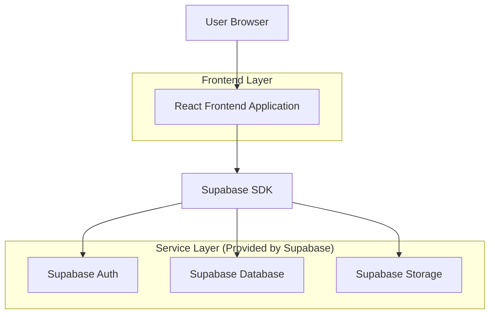
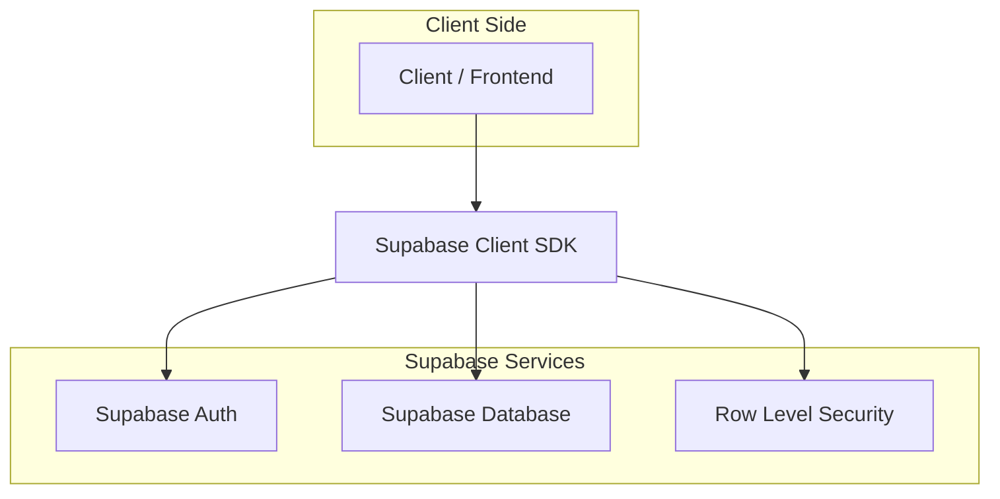
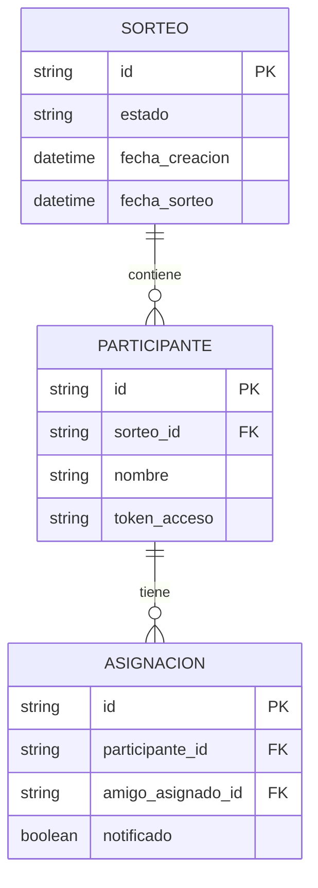

## 1. Architecture design



## 2. Technology Description

* Frontend: React\@18 + tailwindcss\@3 + vite

* Initialization Tool: vite-init

* Backend: Supabase (PostgreSQL, Authentication, Storage)

* Additional: React Router DOM para navegación

## 3. Route definitions

| Route             | Purpose                                                      |
| ----------------- | ------------------------------------------------------------ |
| /                 | Página de inicio con introducción y botón para crear sorteo  |
| /participantes    | Formulario para agregar nombres de participantes             |
| /sorteo/:id       | Página de sorteo con resultados y generación de enlaces      |
| /resultado/:token | Página pública para que participantes vean su amigo asignado |

## 4. API definitions

### 4.1 Core API

**Crear Sorteo**

```
POST /api/sorteos
```

Request:

| Param Name    | Param Type | isRequired | Description                       |
| ------------- | ---------- | ---------- | --------------------------------- |
| participantes | array      | true       | Array de nombres de participantes |

Response:

| Param Name | Param Type | Description         |
| ---------- | ---------- | ------------------- |
| id         | string     | ID único del sorteo |
| status     | string     | Estado del sorteo   |

**Obtener Resultado**

```
GET /api/sorteos/:id/resultado/:token
```

Response:

| Param Name      | Param Type | Description                       |
| --------------- | ---------- | --------------------------------- |
| participante    | string     | Nombre del participante           |
| amigo\_asignado | string     | Nombre del amigo secreto asignado |

## 5. Server architecture diagram



## 6. Data model

### 6.1 Data model definition



### 6.2 Data Definition Language

**Tabla Sorteos**

```sql
-- crear tabla
CREATE TABLE sorteos (
    id UUID PRIMARY KEY DEFAULT gen_random_uuid(),
    estado VARCHAR(20) DEFAULT 'pendiente' CHECK (estado IN ('pendiente', 'completado')),
    fecha_creacion TIMESTAMP WITH TIME ZONE DEFAULT NOW(),
    fecha_sorteo TIMESTAMP WITH TIME ZONE
);

-- crear índices
CREATE INDEX idx_sorteos_estado ON sorteos(estado);
CREATE INDEX idx_sorteos_fecha_creacion ON sorteos(fecha_creacion DESC);

-- permisos
GRANT SELECT ON sorteos TO anon;
GRANT ALL PRIVILEGES ON sorteos TO authenticated;
```

**Tabla Participantes**

```sql
-- crear tabla
CREATE TABLE participantes (
    id UUID PRIMARY KEY DEFAULT gen_random_uuid(),
    sorteo_id UUID REFERENCES sorteos(id) ON DELETE CASCADE,
    nombre VARCHAR(100) NOT NULL,
    token_acceso UUID DEFAULT gen_random_uuid(),
    creado_en TIMESTAMP WITH TIME ZONE DEFAULT NOW()
);

-- crear índices
CREATE INDEX idx_participantes_sorteo_id ON participantes(sorteo_id);
CREATE INDEX idx_participantes_token ON participantes(token_acceso);

-- permisos
GRANT SELECT ON participantes TO anon;
GRANT ALL PRIVILEGES ON participantes TO authenticated;
```

**Tabla Asignaciones**

```sql
-- crear tabla
CREATE TABLE asignaciones (
    id UUID PRIMARY KEY DEFAULT gen_random_uuid(),
    participante_id UUID REFERENCES participantes(id) ON DELETE CASCADE,
    amigo_asignado_id UUID REFERENCES participantes(id) ON DELETE CASCADE,
    notificado BOOLEAN DEFAULT false,
    fecha_asignacion TIMESTAMP WITH TIME ZONE DEFAULT NOW()
);

-- crear índices
CREATE INDEX idx_asignaciones_participante ON asignaciones(participante_id);
CREATE INDEX idx_asignaciones_amigo ON asignaciones(amigo_asignado_id);

-- restricción única para evitar duplicados
CREATE UNIQUE INDEX idx_asignaciones_unicas ON asignaciones(participante_id);

-- permisos
GRANT SELECT ON asignaciones TO anon;
GRANT ALL PRIVILEGES ON asignaciones TO authenticated;
```

**Políticas de seguridad RLS**

```sql
-- Permitir lectura pública de sorteos
CREATE POLICY "Sorteos públicos" ON sorteos
    FOR SELECT USING (true);

-- Permitir lectura pública de participantes con token
CREATE POLICY "Participantes con token" ON participantes
    FOR SELECT USING (true);

-- Permitir lectura pública de asignaciones
CREATE POLICY "Asignaciones públicas" ON asignaciones
    FOR SELECT USING (true);
```

